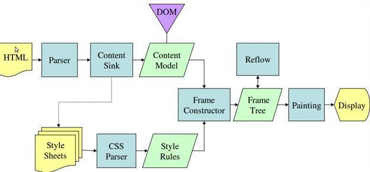

## 개요

**웹 브라우저**는 가장 널리 사용되는 소프트웨어중 하나로 `Webkit`이나 `Gecko`와 같은 렌더링 엔진을 사용한다.

> Chrome, Internet Explorer, Fierfox, Safari, Opera 등등..

`Opera`를 제외한 모든 브라우저는 `Webkit` 렌더링 엔진을 사용하고 있다.

<br><br>

## 주요 기능

`서버(server)`에 `요청(request)`하고 브라우저 창에 웹리소스를 읽어 오는 것으로

일반적으로 `HTML` 문서를 웹 리소스로 하용한다.

리소스의 위치는 `URI(Uniform Resource Identifier)`를 사용하여 사용자가 지정할 수 있다.

> 이러한 브라우저가 HTML 파일을 해석하고 표시하는 방법은
>
> `World Wide Web Consortium (W3C)`에서 관리하고 대부분의 브라우저는 이를 따르고 있습니다.
>
> [W3C 바로가기](https://www.w3.org/)

<br><br>

### 공통 인터페이스

**브라우저**는 일반적으로 사용자 인터페이스를 제공합니다.

- URI 삽입을 위한 주소 표시줄
- 뒤로 및 앞으로 버튼
- 북마크
- 새로고침 버튼
- 홈 버튼

<br><br>

### 브라우저 구조(Structure)


1. 사용자 인터페이스(User Interface)

   브라우저에서 요청된 페이지를 볼 수 있는 창을 제외한 나머지

2. 브라우저 엔진(Browser engine)

   사용자 인터페이스와 렌더링 엔진 사이의 동작을 제어

3. 렌더링 엔진(Rendering engine)

   요청한 콘텐츠를 화면에 표시

4. 통신(Networking)

   `HTTP` 요청과 같은 네트워크 호출에 사용

5. UI Backend

   콤보 박스와 창 같은 기본적인 장치를 그림. (브라우저별 정의된 UI)

6. JavaScript Interpreter

   자바스크립트 해석 및 실행

7. Data Storage

   자료(Data)를 저장

<br>

> `Chorme`과 같은 브라우저는 각 탭마다 별도의 렌더링 엔진 인스턴스를 유지합니다.
>
> 또한, 각 탭은 독립된 프로세스로 처리됩니다.

<br><br>

### 렌더링 엔진의 동작과정

1. `DOM 트리` 구축을 위한 `HTML` 파싱 (html)

2. 렌더 트리 구축 (css, style tag)

3. 렌더 트리 배치 (위치 계산)

4. 렌더 트리 그리기(paint)

렌더링 엔진은 **가능한 한 빨리** 화면에 내용을 표시하려고 하기때문에

모든 `HTML`이 분석이 될때까지 기다리지 않고

일부 콘텐츠가 분석되고 표시되는 동안 네트워크를 통해 전달받은 나머지 콘텐츠로 작업이 계속된다.

<br><br>

## 주요 흐름




<br>

## HTML 파서

`XML`과 `HTML`의 형태가 유사하지만 파서에서 차이가 난다.

`XML`보다 `HTML`은 유연한 문법으로 암묵적인 태그 생략이 가능하다는 점이 큰 차이이다.

<br>

## DOM

`DOM(Document Object Model)`의 줄임말로,

`HTML 문서`를 객체로 표현한 것으로 최상의 객체로는 `문서(Document)`이다.

`DOM`은 마크업과 `1:1 관계`를 맺는다.

간단한 예시를 들어보자.

> 실제 브라우저는 `<head>` 태그와 같이 필수 태그가 없으면 자동 생성하지만 예시를 위한 가정이다.

```html
<html>
  <body>
    <p>Hello World</p>
    <div></div>
  </body>
</html>
```

이것은 아래의 `DOM` 트리 구조로 변환할 수 있다.


<br>

## WebKit CSS Parser

아래의 예시와 같이 파싱이 진행된다.


<br>

## 스크립트와 스타일 시트의 진행 순서

`웹(Web)`은 파싱과 실행이 동시에 수행되는 동기화 모델이다.

파서가 `<script>` 태그를 만나면 즉시 파싱하고 스크립트가 실행되는 동안 문서의 파싱은 중단된다.

> 또한, 개발자는 스크립트를 `defer`로 표시할 수 있는데
>
> 이를 통해 문서 파싱이 완료된 후 스크립트가 실행할 수 있도록 처리할 수 있다.
>
> 대표적으로 `GA(Google Analytics)`를 웹에 적용하는 경우, 사용하는 `<script>`태그는 `defer`로 적용된다.

`HTML5`는 스크립트를 비동기로 처리하는 속성을 추가했기때문에 별도의 맥락에 의해 파싱되고 실행된다.

## Reference

> [MDN Script Tag](https://developer.mozilla.org/ko/docs/Web/HTML/Element/script)
>
> [브라우저는 어떻게 동작하는가? - Naver D2](https://d2.naver.com/helloworld/59361)
>
> [How > Browsers Work: Behind the scenes of modern web browsers - HTML5 Rocks](https://www.html5rocks.com/en/tutorials/internals/howbrowserswork/)

```toc
```
